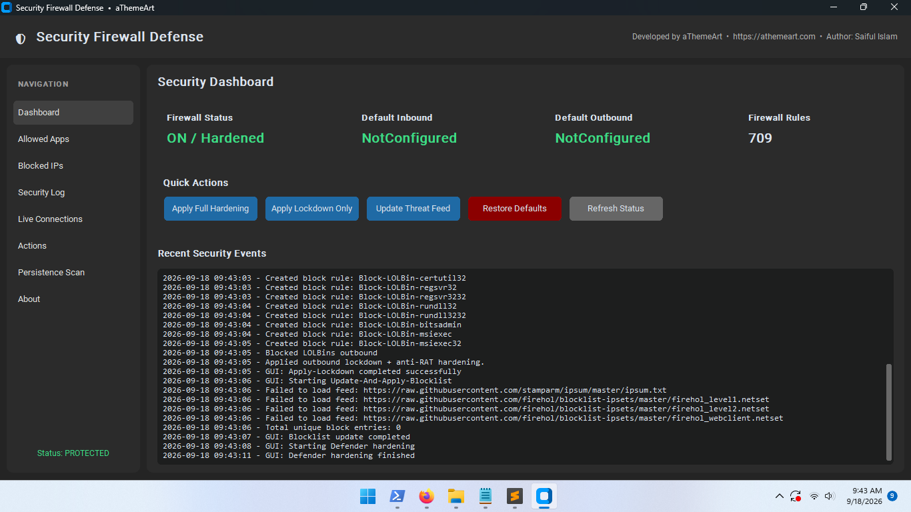
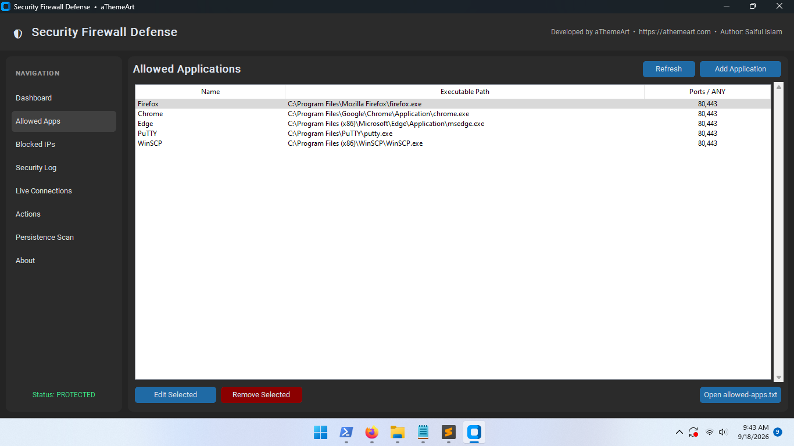
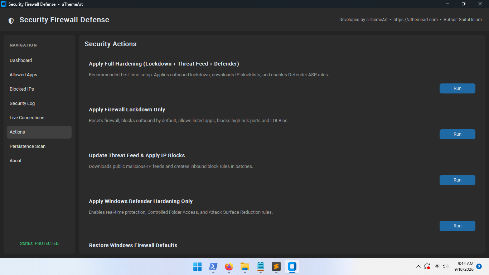
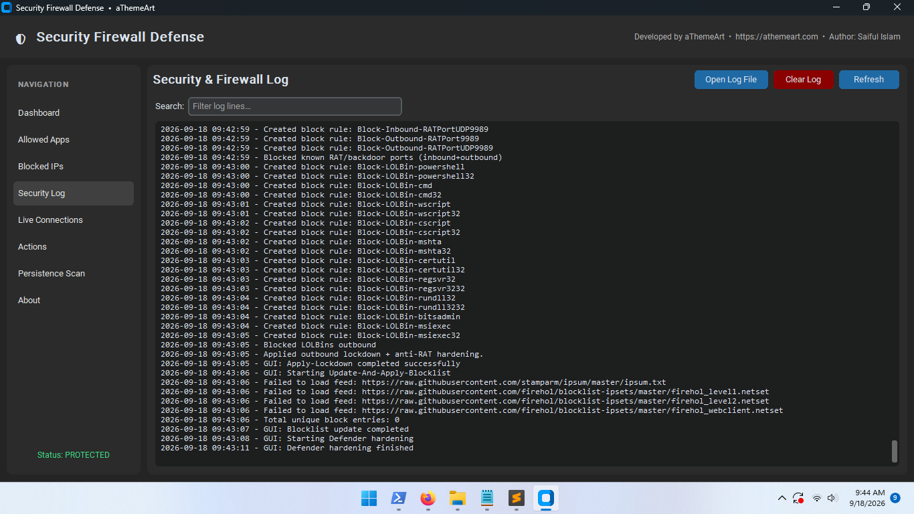

# Windows Security Firewall Defense by aThemeArt.com

**Security Firewall Defense** is a Windows security and firewall monitoring application that provides a user-friendly graphical interface for monitoring and managing Windows Firewall activity and related security information.

It is designed to make common firewall and security-management tasks easier to understand and use without requiring users to manually run PowerShell commands.

> **Security Notice:** Security Firewall Defense is a monitoring and management utility. It is not a replacement for Windows Defender, Microsoft Defender Antivirus, Windows Firewall, or other endpoint-security solutions, and it does not guarantee protection against malware, unauthorized access, or every type of security threat.

---

## Overview

Security Firewall Defense provides a centralized graphical interface for Windows users who want better visibility into firewall and security activity.

The application is based on the project's **PowerShell security and firewall logic**, with a graphical interface intended to make those capabilities easier to access.

Instead of requiring users to work directly with command-line tools, the application provides visual access to information such as:

* Windows Firewall status
* Allowed applications
* Malicious or blocked IP addresses
* Security and firewall logs
* Blocked connection activity
* Configuration information
* Security events and warnings

The application is intended for everyday Windows users, system administrators, developers, and security enthusiasts who want a convenient way to inspect and manage firewall-related information.

---

## Benefits

Security Firewall Defense is designed to provide:

* 🛡️ **Visual security monitoring** — View important firewall and security information through a graphical interface.
* 🖥️ **GUI-based management** — Perform supported tasks without manually entering PowerShell commands.
* 📋 **Allowed application management** — Review and manage applications permitted by the application's configuration.
* 🚫 **Malicious IP management** — Maintain IP addresses that should be treated as malicious or blocked by the application's security logic.
* 📜 **Security and firewall logs** — Review activity and troubleshooting information.
* 🔎 **Improved visibility** — Make blocked or suspicious network activity easier to investigate.
* 📊 **Centralized information** — Bring relevant security information into one interface.
* ⚙️ **Configuration management** — Manage supported security settings from the application.
* 👤 **Beginner-friendly workflow** — Provide an alternative to working directly with command-line tools.

Security Firewall Defense should be considered an additional management and visibility tool rather than a complete security solution.

---

## Features

Depending on the installed version and Windows configuration, Security Firewall Defense may provide the following features.

### Windows Firewall Monitoring

* View Windows Firewall-related status information.
* Review supported firewall activity.
* Monitor firewall-related events.
* Identify blocked connection activity where information is available.

### Allowed Application Management

* View applications listed as allowed.
* Add supported applications to the allowlist.
* Remove applications from the allowlist.
* Review application paths and related configuration.

### Malicious IP Management

* Maintain a list of suspicious or malicious IP addresses.
* Add IP addresses to the application's block configuration.
* Remove IP addresses when appropriate.
* Review configured IP entries.

### Security and Firewall Logs

* View `security-firewall.log`.
* Review firewall-related events.
* Investigate blocked activity.
* Assist with troubleshooting.

### Monitoring

Where supported by the installed version:

* Real-time monitoring
* Periodic status updates
* Security status information
* Firewall activity monitoring
* Event notifications

### Search and Filtering

* Search configuration entries.
* Filter application information.
* Filter IP addresses.
* Find relevant log entries quickly.

### Security Dashboard

The dashboard provides a centralized overview of supported security and firewall information.

### Configuration Management

* Manage application configuration.
* Review security settings.
* Maintain supported allowlists and blocklists.
* View troubleshooting information.

> Feature availability may vary between releases and Windows configurations.

---

# 📸 Screenshots

## Security Firewall Defense Dashboard

The main dashboard provides a visual overview of firewall status, security activity, network protection, and important system information.



---

## Allowed Applications

Review and manage applications configured as allowed by Security Firewall Defense.



---

## Malicious IP Addresses

View and manage IP addresses configured as malicious or blocked by the application's security logic.



---

## Security and Firewall Logs

Review security events, firewall activity, errors, and troubleshooting information through the graphical log viewer.



---

## Screenshot Directory

The screenshots used by this README are stored in:

```text
screenshots/
├── dashboard.png
├── allowed-applications.png
├── malicious-ips.png
└── security-logs.png
```

Make sure these files are committed to the GitHub repository using the exact filenames and directory structure above.

---

# System Requirements

## Operating System

Security Firewall Defense is intended for supported versions of:

* Windows 10
* Windows 11

The exact minimum Windows build should be documented for each release if a future version introduces a specific Windows API requirement.

## Architecture

The release architecture should be specified with each published build:

| Architecture | Status                  |
| ------------ | ----------------------- |
| x64          | Supported / Recommended |
| x86          | Release-dependent       |
| ARM64        | Release-dependent       |

> Do not assume that an x64 build is compatible with every Windows architecture. Download the release appropriate for your system.

## Permissions

Some operations require **Administrator privileges** because Windows restricts access to firewall configuration and other security-sensitive system resources.

The application may therefore request a Windows User Account Control (UAC) confirmation.

## Dependencies

End users should not need to install:

* Python
* PyInstaller
* Inno Setup
* The project's Python virtual environment
* The project's source code

The released Windows application is packaged with the runtime components required by the application.

> Additional Windows components or permissions may be required for specific features.

---

# Installation

## Windows Installer

For normal users, use the official Windows installer from the project's release page.

### Installation Steps

1. Download the latest release from the project's trusted release source.
2. Run:

```text
SecurityFirewallDefense_Setup_<version>.exe
```

3. If Windows displays a User Account Control prompt, review the publisher/application information and choose **Yes** if you trust the installation source.
4. Follow the installation wizard.
5. Accept the license/terms if applicable.
6. Choose the installation location.
7. Complete the installation.
8. Launch **Security Firewall Defense** from the Start Menu or desktop shortcut.

The normal user should **not** need to manually run the project's PowerShell script.

## Installation Location

The default installation location may be:

```text
C:\Program Files\aThemeArt\Security Firewall Defense\
```

The exact location can be changed during installation if supported by the installer.

---

# Uninstallation

### Windows 11

Go to:

```text
Settings
→ Apps
→ Installed apps
→ Security Firewall Defense
→ Uninstall
```

### Windows 10

Go to:

```text
Settings
→ Apps
→ Apps & features
→ Security Firewall Defense
→ Uninstall
```

You can also use:

```text
Control Panel
→ Programs
→ Programs and Features
```

if the installed version provides a traditional Windows uninstaller.

> Configuration and log files may be retained depending on the installer and application version. Review the release documentation before manually deleting application data.

---

# How to Use

## 1. Launch Security Firewall Defense

Open the application from:

* Desktop shortcut
* Start Menu
* Installed application directory

Some operations may trigger a Windows UAC prompt because they require administrator privileges.

---

## 2. Understand the Dashboard

The dashboard provides an overview of the information supported by the current release.

Depending on the version, it may show:

* Firewall status
* Security status
* Allowed applications
* Malicious IP entries
* Recent events
* Blocked connections
* Log information
* Notifications or warnings

Use the dashboard as an overview rather than assuming that every displayed status represents complete system security.

---

## 3. Manage Allowed Applications

The application may use:

```text
allowed-apps.txt
```

to maintain its application allowlist.

A typical entry may identify an application path:

```text
C:\Program Files\Example\Application.exe
```

### Adding an Application

1. Open **Allowed Applications**.
2. Select **Add Application**.
3. Choose the executable.
4. Review the application path.
5. Confirm the change.

### Removing an Application

1. Open **Allowed Applications**.
2. Locate the application.
3. Review the entry.
4. Select **Remove**.
5. Confirm the change.

Only allow applications that you trust and understand.

---

# Managing Malicious IP Addresses

The application may use:

```text
malicious-ips.txt
```

to maintain IP addresses that should be treated as malicious or blocked by the application's security logic.

Example documentation entries:

```text
203.0.113.10
198.51.100.25
```

> The addresses above are documentation examples using reserved documentation ranges. Do not treat examples in this README as threat intelligence.

### Adding an IP Address

1. Open **Malicious IPs**.
2. Select **Add**.
3. Enter the IP address.
4. Verify the address carefully.
5. Confirm the change.

### Removing an IP Address

1. Locate the IP address.
2. Review the entry.
3. Select **Remove**.
4. Confirm the change.

Do not add an IP address to a blocklist solely because it appears unfamiliar. Verify the source and context before changing security configuration.

---

# Viewing Security and Firewall Logs

Security Firewall Defense may maintain:

```text
security-firewall.log
```

The log can help users investigate:

* Blocked connections
* Security events
* Firewall activity
* Configuration changes
* Errors
* Troubleshooting information

When investigating unexpected behavior, check the timestamp and event details rather than relying on a single log entry.

---

# Search and Filtering

Where supported, use the application's search and filtering tools to find:

* Specific applications
* IP addresses
* Log entries
* Firewall events
* Security events
* Recent activity

For example, searching for an IP address can help identify related log entries and configuration entries.

---

# Warnings and Notifications

Security Firewall Defense may display warnings when it detects or encounters supported security events.

A warning does not necessarily mean that malware is present.

For example, an unexpected connection could be:

* A legitimate application update
* A browser connection
* A Windows service
* A third-party application
* An incorrectly configured application
* Potentially unwanted or suspicious activity

Review the application, destination, timestamp, and surrounding log information before taking action.

---

# Configuration and Data Files

Security Firewall Defense may use several data files.

| File                    | Purpose                                                                                     |
| ----------------------- | ------------------------------------------------------------------------------------------- |
| `allowed-apps.txt`      | Stores applications configured as allowed by the application's security logic.              |
| `malicious-ips.txt`     | Stores IP addresses configured as malicious or blocked by the application's security logic. |
| `security-firewall.log` | Stores security/firewall activity and troubleshooting information.                          |

## Data Location

Depending on the release and installer configuration, application data may be stored inside the application's data directory.

For example:

```text
C:\Program Files\aThemeArt\Security Firewall Defense\data\
```

or another application-specific data directory.

The exact location should be checked in the installed version's configuration or documentation.

## Manual Editing

If manual editing is supported, close the application before changing configuration files unless the documentation for the specific release states otherwise.

Do not:

* Add invalid entries.
* Add unknown applications without understanding the consequences.
* Add unverified IP addresses.
* Delete files while the application is actively writing to them.
* Modify application binaries or internal files.

Always keep a backup before manually changing configuration files.

---

# Security and Permissions

Security Firewall Defense may require Administrator privileges for operations that modify or inspect protected Windows resources.

This can include firewall-related operations because Windows restricts changes to firewall configuration.

## Why UAC Appears

Windows User Account Control (UAC) helps prevent applications from silently performing privileged operations.

You may therefore see a Windows prompt asking whether you want to allow the application to make changes to your device.

Only approve elevation when:

* You intentionally launched Security Firewall Defense.
* You downloaded it from a trusted source.
* The publisher/application information is what you expect.

## Security Recommendations

For safer operation:

* Only allow applications that you trust.
* Verify application paths before adding them to an allowlist.
* Do not add unknown IP addresses to an allowlist without understanding the consequences.
* Review unexpected firewall activity.
* Keep Windows updated.
* Keep Microsoft Defender and other security software updated.
* Download releases only from trusted project sources.
* Keep backups of important configuration data.
* Do not disable Windows security features simply because an application reports a warning.

> Security Firewall Defense complements Windows security controls; it is not intended to replace them.

---

# Troubleshooting

## Application Does Not Start

Try the following:

1. Confirm that Windows meets the supported system requirements.
2. Restart Windows and try again.
3. Run the application from the installed shortcut.
4. Check whether Windows Security or another security product has displayed a warning.
5. Confirm that the application was downloaded from a trusted source.
6. Check the application's logs if available.
7. Install the latest release if the problem has already been fixed.

Do not disable Windows security protections simply to make the application start.

## Administrator Permission Error

If firewall operations fail:

1. Confirm that you are using an account permitted to perform administrative operations.
2. Accept the UAC prompt when the application requests elevation.
3. Check whether your organization manages Windows security policies.
4. Check Windows Event Viewer for related errors.
5. Verify that Windows Firewall is enabled and functioning normally.

On managed computers, Group Policy, Microsoft Defender policies, or other enterprise security controls may prevent changes even for applications running with administrative privileges.

## Firewall Rules Cannot Be Changed

Possible causes include:

* Insufficient permissions.
* Windows Firewall service problems.
* Group Policy restrictions.
* Security software restrictions.
* Invalid configuration.
* Another security-management application controlling the firewall.

Check Windows Event Viewer and the application log for additional information.

## Logs Are Not Being Updated

Check:

1. Whether the application is running.
2. Whether the application has permission to write to its data directory.
3. Whether the configured log path is correct.
4. Whether another application is locking the file.
5. Whether the log directory exists.
6. Whether Windows security software is restricting access.

Avoid manually modifying the log while the application is actively writing to it.

## Configuration Files Cannot Be Modified

If files cannot be changed:

1. Close Security Firewall Defense.
2. Check the file permissions.
3. Check whether the file is read-only.
4. Verify that another program is not using the file.
5. Use the application's GUI to make changes where possible.

Do not modify files under `Program Files` unnecessarily. Application data should preferably be stored in an appropriate writable data directory.

## An Application Is Incorrectly Blocked

If a trusted application is blocked:

1. Verify the executable path.
2. Confirm that you trust the application.
3. Check the Security Firewall Defense log.
4. Check Windows Firewall logs/events.
5. Review the application's current allowlist.
6. Check whether another Windows security policy is responsible.
7. Make the smallest appropriate configuration change.

Do not automatically allow an application simply because it is being blocked.

## Windows Defender or Another Security Product Reports a Warning

If security software reports a warning:

1. Do not immediately disable Microsoft Defender or other security protections.
2. Verify that the application came from the official project release.
3. Verify the file's publisher/signature when available.
4. Review the detection name and details.
5. Report the issue to the project if you believe it is a false positive.
6. Include relevant non-sensitive technical information in the report.

Security warnings should be investigated rather than bypassed blindly.

---

# FAQ

### Is Security Firewall Defense a replacement for Windows Defender?

**No.**

Security Firewall Defense is intended as a monitoring and management utility. It does not replace Microsoft Defender Antivirus or other endpoint-security products.

### Does it replace Windows Firewall?

**No.**

The application works with supported Windows Firewall functionality. It is not intended to replace the Windows Firewall subsystem itself.

### Does Security Firewall Defense guarantee protection from malware?

**No.**

No single application can guarantee protection against every malware sample, attack, vulnerability, or security threat.

Security Firewall Defense is intended to improve visibility and assist with firewall/security management.

### Why does the application require Administrator privileges?

Some Windows Firewall and security operations are restricted by Windows and require elevated privileges.

The application may therefore request UAC elevation when performing operations that require administrative access.

### Can I manually edit the configuration files?

If manual configuration is supported by the installed release, files such as:

```text
allowed-apps.txt
malicious-ips.txt
```

may be edited manually.

However, the GUI is preferred where available because it can validate and manage configuration more safely.

Always make a backup before manually changing configuration files.

### Where are the logs stored?

The application may maintain:

```text
security-firewall.log
```

inside its configured data/log directory.

The exact location may vary by release and installation configuration.

### How can I report a problem?

For normal bugs and feature requests, open a GitHub Issue in the project's repository.

Before opening an issue, include:

* Windows version
* Security Firewall Defense version
* Application architecture
* Steps to reproduce the problem
* Expected behavior
* Actual behavior
* Relevant error messages
* Relevant application logs

Remove passwords, tokens, personal information, internal IP addresses, or other sensitive information before posting.

---

# 🤝 Contributing

Contributions from developers, Windows enthusiasts, security researchers, testers, documentation writers, and translators are welcome.

We would especially appreciate contributions in:

* Bug fixes
* UI/UX improvements
* Performance improvements
* Security improvements
* PowerShell improvements
* Windows Firewall integration
* New monitoring features
* Documentation
* Testing
* Accessibility improvements
* Localization and translations
* Error handling
* Logging improvements

## Development Workflow

### 1. Fork the Repository

Create your own fork of the GitHub repository.

### 2. Clone the Repository

```powershell
git clone https://github.com/<your-account>/SecurityFirewallDefense.git
cd SecurityFirewallDefense
```

Replace the repository URL with the actual project repository.

### 3. Create a Feature Branch

```powershell
git checkout -b feature/my-new-feature
```

For a bug fix:

```powershell
git checkout -b fix/firewall-monitoring
```

### 4. Set Up the Development Environment

```powershell
py -m venv .venv
```

Activate the environment:

```powershell
.\.venv\Scripts\Activate.ps1
```

Install dependencies:

```powershell
python -m pip install --upgrade pip
python -m pip install -r requirements.txt
```

### 5. Make Your Changes

Follow the project's existing structure and coding conventions.

Avoid introducing:

* Hard-coded personal paths
* Credentials
* API keys
* Passwords
* Private IP information
* Debug code intended for production
* Security bypasses
* Unnecessary changes to Windows security settings

### 6. Test on Windows

Test changes on a supported Windows version.

Where appropriate, test:

* Normal application startup
* Administrator/UAC behavior
* Windows Firewall operations
* Configuration changes
* Log generation
* Error handling
* Installation
* Uninstallation
* Upgrade scenarios

Security-sensitive changes should receive additional testing.

### 7. Commit Your Changes

```powershell
git add .
git commit -m "Improve firewall event monitoring"
```

### 8. Push Your Branch

```powershell
git push origin feature/my-new-feature
```

### 9. Open a Pull Request

Create a Pull Request against the project's main development branch.

Please explain:

* What changed.
* Why the change was needed.
* How it was tested.
* Which Windows versions were tested.
* Any security implications.
* Any configuration changes required.

### Security-Sensitive Contributions

If a Pull Request changes:

* Firewall rules
* Windows security settings
* Administrator privileges
* PowerShell execution
* Network blocking
* Allowlisting
* Security event processing
* Defender integration

please explain the security implications clearly.

Avoid changes designed to disable, bypass, evade, or weaken Windows security controls unless the change has a clearly documented and legitimate administrative purpose.

---

# Development

## Project Structure

The project is organized approximately as follows:

```text
SecurityFirewallDefense/
│
├── src/
│   ├── main.py
│   ├── __init__.py
│   │
│   ├── core/
│   │   ├── __init__.py
│   │   ├── admin.py
│   │   ├── firewall.py
│   │   └── paths.py
│   │
│   └── ui/
│       └── __init__.py
│
├── scripts/
│   ├── build_exe.bat
│   └── Security-Firewall-Defense.ps1
│
├── installer/
│   ├── SecurityFirewallDefense.iss
│   ├── build_installer.bat
│   └── output/
│
├── screenshots/
│   ├── dashboard.png
│   ├── allowed-applications.png
│   ├── malicious-ips.png
│   └── security-logs.png
│
├── requirements.txt
├── LICENSE
└── README.md
```

The exact structure may change as the project develops.

---

# Building the Windows Application

The project can use **PyInstaller** to package the Python application.

Build scripts may be provided with the project.

For example:

```powershell
.\scripts\build_exe.bat
```

A development build may be generated under:

```text
dist\
```

For example:

```text
dist\
└── SecurityFirewallDefense\
    ├── SecurityFirewallDefense.exe
    ├── _internal\
    ├── assets\
    └── scripts\
```

The exact output depends on the current PyInstaller configuration.

---

# Creating the Windows Installer

The project can use **Inno Setup** to create the Windows installer.

After successfully building and testing the application:

```powershell
.\installer\build_installer.bat
```

The installer output may be generated under:

```text
installer\output\
```

For example:

```text
SecurityFirewallDefense_Setup_1.0.0.exe
```

The installer should be tested on a clean Windows environment before public release.

---

# Release Checklist

Before publishing a new version:

* [ ] Test the application on a supported Windows version.
* [ ] Test Administrator/UAC behavior.
* [ ] Test Windows Firewall functionality.
* [ ] Test configuration management.
* [ ] Test allowed applications.
* [ ] Test malicious IP management.
* [ ] Test logging.
* [ ] Test search and filtering.
* [ ] Test application startup.
* [ ] Test installation.
* [ ] Test uninstallation.
* [ ] Test upgrade from the previous version.
* [ ] Review Windows Security/Defender behavior.
* [ ] Check for accidental debug code.
* [ ] Check for credentials or secrets.
* [ ] Verify version information.
* [ ] Verify application branding.
* [ ] Code-sign release binaries when signing infrastructure is available.
* [ ] Test the installer on a clean Windows system.
* [ ] Update release notes.
* [ ] Create the GitHub release.
* [ ] Upload the final installer.

For a security-focused application, release testing should be performed carefully before distributing binaries publicly.

---

# Reporting Bugs and Security Issues

## Bug Reports

For normal bugs, please use the project's GitHub Issues.

Include:

```text
Security Firewall Defense version:
Windows version:
Architecture:
Problem:
Steps to reproduce:
Expected result:
Actual result:
Error message:
Relevant log information:
```

Do not include sensitive personal or system information.

## Security Vulnerabilities

**Do not publicly disclose sensitive vulnerability details in a normal GitHub Issue.**

If the project has a private security-reporting mechanism configured, use that method instead.

Examples include:

* GitHub Security Advisories
* A designated security email address
* A private vulnerability-reporting system

If no private reporting mechanism has been configured yet, the project maintainers should establish one before requesting detailed vulnerability reports.

---

# Roadmap

Potential future improvements may include:

* Enhanced firewall event monitoring
* Improved dashboard visualizations
* More detailed security-event analysis
* Improved application allowlist management
* Improved IP management
* Advanced search and filtering
* Notification improvements
* Additional Windows Firewall integration
* Accessibility improvements
* Localization
* Performance improvements
* More detailed troubleshooting tools
* Enhanced logging
* Additional Windows security integrations

Features are subject to development priorities and technical feasibility.

---

# License

This project is licensed under the **[LICENSE NAME]**.

See the `LICENSE` file for details.

> Replace `[LICENSE NAME]` with the actual license selected for the project before publishing.

---

# Credits and Branding

## Security Firewall Defense

**Developed by [aThemeArt](https://athemeart.com)**

**Author:** Saiful Islam

**Website:** https://athemeart.com

Security Firewall Defense is developed as a Windows security and firewall monitoring and management application with a focus on usability, visibility, and practical administration.

---

# Support

For questions, bugs, feature requests, and development discussions, please use the project's official GitHub repository and its available issue/discussion channels.

When requesting support, provide useful technical information while removing passwords, credentials, personal information, and other sensitive data.

---

# Disclaimer

Security Firewall Defense is provided as a security and firewall monitoring/management utility. Users are responsible for reviewing and understanding security configuration changes made through the application.

The software does not guarantee protection against malware, unauthorized access, network attacks, vulnerabilities, data loss, or other security incidents.

Always maintain appropriate backups and use Security Firewall Defense together with a properly configured Windows security environment.
